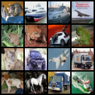

# ml-toolkit-lab
ML research toolkit with modular training engine (PyTorch), CV + NLP pipelines, differential privacy (DP-SGD), and optimization utilities

This repo is a compact ML research toolkit demonstrating:
- **Computer Vision**: CIFAR-10 classification with ResNet18
- **NLP / NLU**: Sentiment classification from CSV with BiLSTM
- **Optimization**: modular optimizer + scheduler + gradient clipping + early stopping
- **Privacy**: optional Differential Privacy (DP-SGD) using Opacus
- **C++**: a small SGD demo implementation

## Example results (sanity run)
CIFAR-10 (ResNet18, 1 epoch, batch=256): val acc ~0.60
## Visual: CIFAR-10 predictions 
Grid of 16 CIFAR-10 test images. Labels are printed in the terminal (pred vs true).

## Results (quick sanity runs)
- NLP sentiment (toy CSV, 2 epochs): best acc ~1.00 (small dataset)
- CIFAR-10 (ResNet18, 1 epoch, batch=256): val acc ~0.60





## Quickstart

```bash
python -m venv .venv && source .venv/bin/activate
pip install -r requirements.txt

